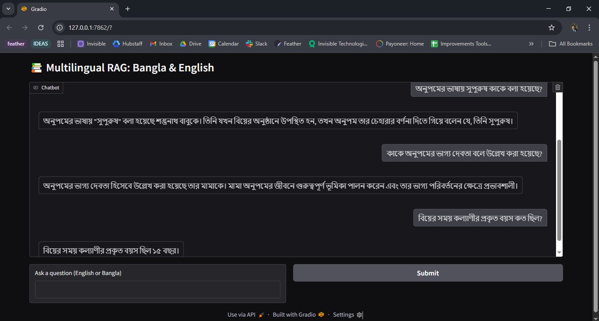

# HSC26 Bangla 1st Paper Simple RAG project

This project is a simple Retrieval-Augmented Generation (RAG) system capable of answering both Bangla and English questions using OCR-extracted content from an HSC Bangla 2026 1st Paper textbook PDF. You can test the application here: [HSC26-Bangla1st-Paper-Simple-RAG](https://huggingface.co/spaces/ashfaqsayeem/HSC26-Bangla1st-Paper-Simple-RAG)


## 🚀 Setup Guide

### Requirements

## ✅ 1. Text Extraction from PDF (OCR)

📄 **Input:** `HSC26-Bangla1st-Paper.pdf`  
🧾 **Output:** `HSC26_Bangla1st_OCR_With_Tables.txt` (cleaned Bengali text with tables)  
📁 **Notebook:** `pdf_to_txt.ipynb`

---

### 🔧 Requirements (Local Machine Only)

To run the OCR pipeline, the following **must be installed locally**:

- **Tesseract OCR**
  - 📥 [Download for Windows](https://github.com/UB-Mannheim/tesseract/wiki)
  - https://github.com/tesseract-ocr/tesseract/releases/download/5.5.0/tesseract-ocr-w64-setup-5.5.0.20241111.exe Download This!
  - Don't forget to select Bengali in additional settings during installing via .exe file
  - Add the install path (e.g., `C:\Program Files\Tesseract-OCR`) to your system `PATH`.

- **Poppler for Windows**
  - 📥 [Download from here](https://github.com/oschwartz10612/poppler-windows/releases/)
  - Extract the ZIP and add the `poppler/bin` folder to your system `PATH`.

---

### 🧪 How to Run

Open and run the notebook `pdf_to_txt.ipynb`. It will:

- Convert each PDF page into an image
- Use Bengali OCR (`lang='ben'`) via Tesseract
- Extract text and save to `HSC26_Bangla1st_OCR_With_Tables.txt`
- Use Camelot to extract all tables and append them to the same `.txt` file

> ⚠️ This notebook must be run **locally**. Hugging Face Spaces does not support Poppler or Tesseract binaries.

---

## ✅ 2. RAG Pipeline with Text File

📄 **Input:** `HSC26_Bangla1st_OCR_With_Tables.txt`  
🧠 **Notebook:** `rag_project_expreimental.ipynb`  
✅ No need to re-run OCR if you already have the text file

---

You can **skip the OCR step** and directly run the notebook `rag_project_expreimental.ipynb`. This notebook will:

- Load the cleaned `.txt` file
- Chunk the content and create semantic embeddings using `BAAI/bge-m3`
- Store the embeddings in a `ChromaDB` vector store
- Accept both **Bangla** and **English** queries
- Return accurate, context-aware answers

---

## 📦 Dependencies

Install all Python dependencies with:

```bash
pip install -r requirements.txt
```

## ✅ Libraries & Packages Used

The `requirements.txt` file contains all necessary Python packages:

- langchain  
- langchain-community  
- langchain-openai  
- langchainhub  
- chromadb  
- openai  
- huggingface-hub  
- sentence-transformers  
- python-dotenv  
- gradio  

## 📦 Library Usage & Purpose (from actual imports)
| Library                            | Import                                    | Purpose                                              |
| ---------------------------------- | ----------------------------------------- | ---------------------------------------------------- |
| `os`                               | `import os`                               | File path manipulation, directory checking           |
| `pytesseract`                      | `import pytesseract`                      | OCR on PDF images (Bangla language supported)        |
| `pdf2image`                        | `from pdf2image import convert_from_path` | Converts PDF pages to images for OCR                 |
| `camelot`                          | `import camelot`                          | Table extraction from PDFs                           |
| `langchain.document_loaders`       | `TextLoader`                              | Load raw text file into LangChain `Document`         |
| `langchain.text_splitter`          | `RecursiveCharacterTextSplitter`          | Create semantic chunks from the loaded text          |
| `langchain_community.vectorstores` | `Chroma`                                  | Store embeddings in a persistent vectorstore         |
| `langchain.embeddings`             | `HuggingFaceEmbeddings`                   | Use a multilingual embedding model (`BAAI/bge-m3`)   |
| `langchain.chains`                 | `RetrievalQA`                             | Set up the question-answering logic over vectorstore |
| `gradio`                           | `import gradio as gr`                     | Build simple interactive UI for query input/output   |


🤖 Sample Queries & Expected Outputs
You can ask your questions in Bangla or English. Below are three sample Bangla queries:

| 🔍 প্রশ্ন                                       | 🧠 প্রত্যাশিত উত্তর |
| ----------------------------------------------- | ------------------- |
| অনুপমের ভাষায় সুপুরুষ কাকে বলা হয়েছে?         | শুম্ভুনাথ           |
| কাকে অনুপমের ভাগ্য দেবতা বলে উল্লেখ করা হয়েছে? | মামা                |
| বিয়ের সময় কল্যাণীর প্রকৃত বয়স কত ছিল?        | ১৫ বছর              |



## Application
To run the application locally, you will also need your own OpenAI API key stored in a `.env` file. However, I am using my own API key and have converted the `app.ipynb` notebook into an `app.py` file, which is hosted on Hugging Face Spaces. You can test the application here: [HSC26-Bangla1st-Paper-Simple-RAG](https://huggingface.co/spaces/ashfaqsayeem/HSC26-Bangla1st-Paper-Simple-RAG)

## Here are the six questions you asked, compiled into a sorted PDF for easier analysis and review: [Download PDF](./10MS_Questions_RAG.pdf)

